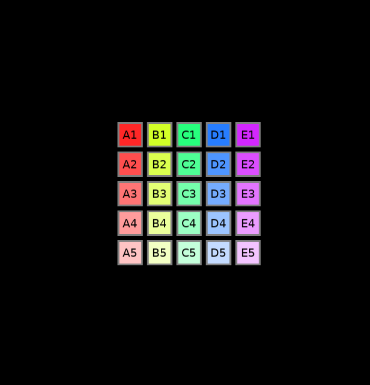
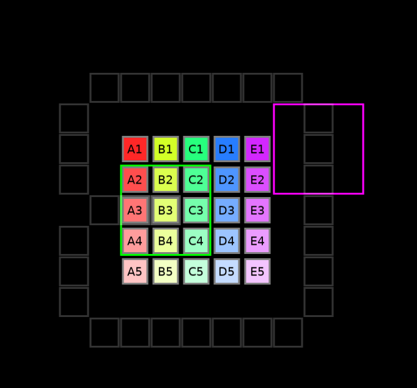
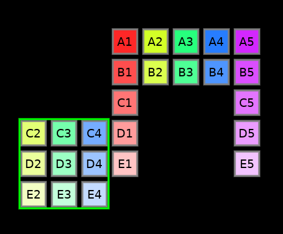

# relocation
2d puzzle involving moving groups of tiles around under a certain ruleset.

## controls

### basic
left click on the center of a 3x3 area to start moving it. left click again at the center of the destination.

if both squares are "stable" (connected to other pieces), you can swap them by clicking on both.

right click and drag to pan around.

ctrl+z to undo.

ctrl+shift+z or ctrl+y to redo.

right arrow to open the menu. arrow keys to use the menu.

### board manipulation
esc to reset.

1 for 5x5 grid and 3x3 selection area, 2 for 5x5 grid and 2x2 selection area (thus notated "5x5+3" and "5x5+2").

w and shift+w to increase and decrease width respectively. 

h and shift+h to increase and decrease height respectively.

s and shift+s to increase and decrease selection box size respectively.

### audiovisual

g to toggle the grid. it starts on by default.

m to toggle sound effects.

## mechanics

25 tiles are arranged in a square at the center initially.

one may move any 3x3 area to any destination that is adjacent orthogonally to a tile.

however, one may not move a 3x3 area if it does not contain all 9 tiles. for instance, only one area may be moved here.

the allowed space is theoretically infinite.

## installation

### windows

go to "releases". download the windows .zip file. extract it somewhere, and run the .exe file. everything should work. add desktop/start menu shortcuts to taste.

### mac
i honestly have no idea. you're on your own.

### linux

download love2d for your system via a package manager or what have you. then, use it to run either the .love file from releases, or the directory containing main.lua if you just clone the repository.

an appimage will be available if enough people complain at me about the lack of it.

## to-do list

### high-priority
* ~~undo, redo.~~ implemented in v1.4.0.
* ~~zoom in/out.~~ implemented in v1.5.0.
* implement provably possible scrambling.
* more visible status things (UI is hard).
* ~~even selection box sizes make the placement preview look uncomfortably misaligned, but i haven't figured out a good solution to this yet.~~ implemented in v1.5.2.

### medium priority

* saving and loading puzzle states.
* generally logging puzzle actions.
* some sort of notation for puzzle actions.
* in-application documentation.
* touch support, especially pinching to zoom.

### low priority
* cooler visual effects, possibly shader-involving.
* more visual customization in general.
* ~~sound effects.~~ implemented in v1.5.2.
* accessibility and keyboard-based controls.
* different rulesets and shapes and such.

### way too ambitious to be in low priority

* in-application screenshot taking.
* in-application video recording, even?