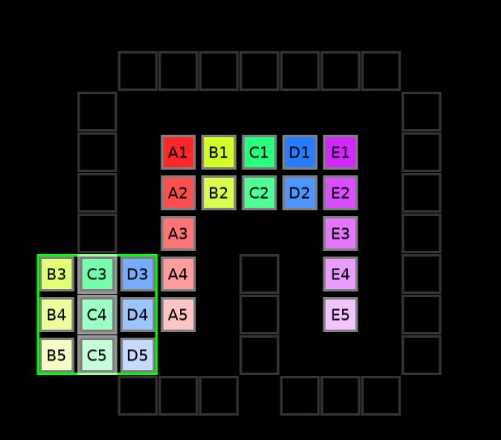

# relocation
2d puzzle involving moving groups of tiles around under a certain ruleset.

## controls
left click on the center of a 3x3 area to start moving it. left click again at the center of the destination.

right click and drag to pan around.

esc to reset, s to scramble.

## mechanics

25 tiles are arranged in a square at the center initially.

one may move any 3x3 area to any destination that is adjacent orthogonally to a tile.

however, one may not move a 3x3 area if it does not contain all 9 tiles. for instance, only one area may be moved here.

the allowed space is theoretically infinite.

## installation

### windows

go to "releases". download the windows .zip file. extract it somewhere, and run the .exe file. everything should work. add desktop/start menu shortcuts to taste.

### mac
i honestly have no idea. you're on your own.

### linux

download love2d for your system via a package manager or what have you. then, use it to run either the .love file from releases, or the directory containing main.lua if you just clone the repository.

an appimage will be available if enough people complain at me about the lack of it.